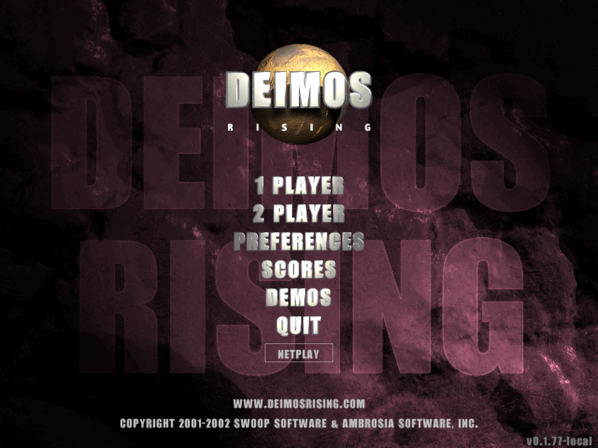

# Deimos Rose

This is a recreation of Deimos Rising based on the decompiled windows build of the game (1.0.2)

The game is playable from start to finish, the gameplay feels almost 1:1, but the presentation is not perfect.
[Downloads are here under assets](https://github.com/Keristero/deimos-rose/releases)
There are builds for windows and linux.

#### Enhancements:
- Online netplay with rollback and reconnect functionality. (port 60902)
- High refresh rate mode, drawing smoothly between game updates (Preferences)

#### Upcoming enhancements:
- Classic mode which simply aims to be as faithful as possible to the original
- Easy mode which gives the player a powerup after each stage they complete
- Infinite procedural roguelike mode

#### Known issues
- Some sounds use the wrong sound effects, eg weapons are swapped etc.
- Enemies can be visible offscreen in window mode
- Menus dont match originals
- Missing or strange looking visuals, eg:
   - Missing scorch marks on ground after ground fire
   - Air to ground crosshairs missing
   - Air to ground weapon looks weird
   - Smoke looks weird
   - Score ticker at end of level missing
   - First Air to Air weapon is missing some small impact particle effects

#### Known enhancement issues:
- Sometimes when players reconnect they might see the wrong level background loaded

#### Other details:
- The game has been reimplemented in odin with the raylib library.
- Custom UDP networking + rollback implementation

## Related work

[adamjvr/Deimos-Rising-Remastered](https://github.com/adamjvr/Deimos-Rising-Remastered)

## Legal

Deimos Rising is © 2001–2003 Swoop Software and Ambrosia Software, Inc.
The game is currently classified as abandonware.