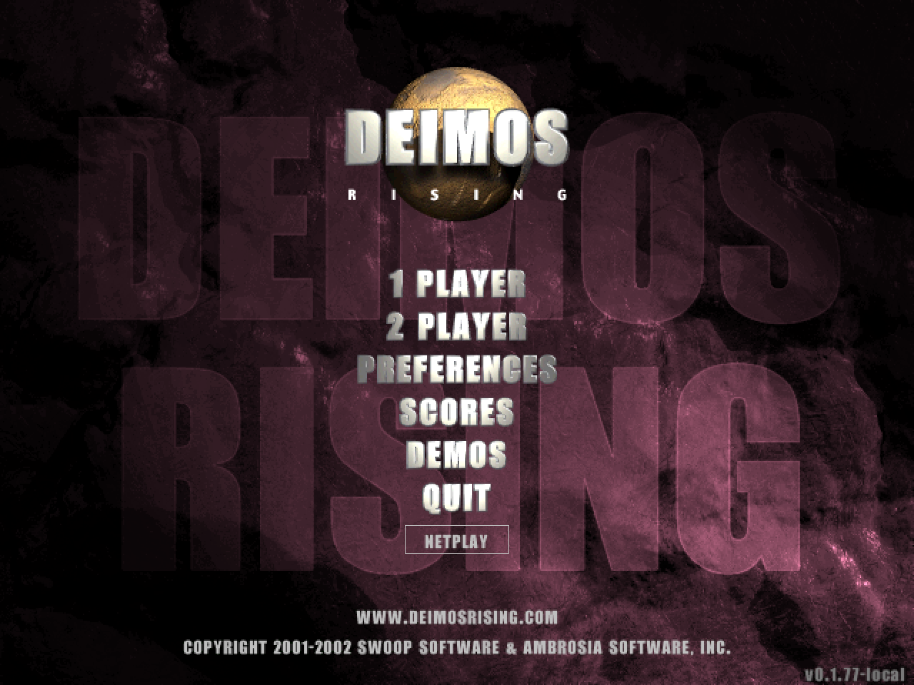

# Deimos Rose

This is a recreation of Deimos Rising based on the decompiled windows build of the game (1.0.2)

The game is playable from start to finish, the gameplay feels almost 1:1, but the presentation is not perfect.
[Downloads are here under assets](https://github.com/Keristero/deimos-rose/releases)
There are builds for windows and linux.

#### Enhancements:
- Online netplay with rollback and reconnect functionality. (port 60902)
- High refresh rate mode, drawing smoothly between game updates (Preferences)

There is also a Classic mode which disables all enhancements and attempts to present the graphics and colors as faithfully to the original as possible.

#### Upcoming enhancements:
- HD upscaled textures, reflections, and new shader effects for water and more
- Easy mode which gives the player a powerup after each stage they complete
- Infinite procedural roguelike mode with new guns and biomes

#### Known issues
- Some sounds use the wrong sound effects, eg weapons are swapped etc. (fixed I think)
- Enemies can be visible offscreen in window mode, most notably just before they spawn in from the sides (fixed I think)
- Menus dont match originals
- Missing or strange looking visuals, eg:
   - Missing scorch marks on ground after ground fire

#### Known enhancement issues:
- Sometimes when players reconnect they might see the wrong level background loaded

#### Other details:
- The game has been reimplemented in odin with the raylib library.
- Custom UDP networking + rollback implementation

## The `ecs-refactor` branch

This branch moves the simulation onto an entity component system
(odecs), and moves the enhancements out of the core into plugins under
`src/plugins/`. The design and its verification are in
[src/docs/phase-9-ecs.md](src/docs/phase-9-ecs.md).

### Performance compared with `main`

Measured on 2026-09-27 with `mise run bench` (`tools/simbench`), ported
to `main`'s API so both branches run the same workload. Best of 5 runs,
built with `-o:speed`, three runs of each branch in turn, agreeing to
within 1%.

| | main | ecs-refactor | |
|---|---|---|---|
| Demo replays (29,181 steps) | 3.5 µs/step | 11.0 µs/step | 3.1× slower |
| Every level, co-op, random input (72,000 steps) | 6.6 µs/step | 15.3 µs/step | 2.3× slower |
| Snapshot size | 690 KB (always) | 48 KB mid-level, 109 KB at the fullest | 6-14× smaller |
| Snapshot save / restore (level 6, step 2000) | 8.1 / 8.1 µs | 3.3 / 3.0 µs | ~2.6× faster |
| 10-frame rollback (level 6) | 107 µs | 46 µs | ~2.3× faster |

- **Stepping the simulation is 2-3× slower.** It was 3-4× before the
  prefab table, the inlined pool walk and per-prefab stage masks.
  Rollback is cheaper, because snapshots only hold what is in use.
- **The checksum costs more (7.7 µs against 0.33 µs), but it also hashes
  far more.** `main` hashes only the RNG, the level and the players, so
  the two figures are not comparable.
- **Where the time goes** (a profile taken before those speed-ups;
  `mise run bench:profile` now measures it): 95% of step time is in the
  entities system. The
  `shot_collisions` stage is the largest part at 18%, and no other stage
  passes 6%. About a third of the time is outside the stages that were
  listed: the loop, stage matching, and many small stages.
- **Not a problem in play yet.** 15 µs is a small share of a frame. It
  does slow film replays and tests, and it limits how deep rollback can
  go before stepping costs more than snapshots save.

### To do

Performance:

- [x] Look up prefab components once per session. `prefab_component` and
  `prefab_has` (`src/sim/prefabs.odin`) do an odecs hash-map lookup and
  column search on every call, but prefabs never change during a session.
  Build a flat table from each prefab to its components at `init`, and
  make `prefab_has` a bit in the existing `matches` bitset. Prove it
  neutral: `oracle:diff` exact, fingerprints unchanged. Done; each
  entity also visits only the stages its prefab takes part in.
- [ ] Make the collision inner loop cheaper without changing its order.
  `entity_collisions` (`src/sim/systems/collision_system/contact.odin`)
  copies a 64-byte `Entity` view per visit and follows pointers into
  separate columns. Walk group order once per step into a compact array
  of what the check reads, so the random draws keep their order.
- [x] Build per-system and per-stage timing into `tools/simbench` behind
  a `-define` flag (a no-op by default, so `sim/` stays pure). Done:
  `mise run bench:profile`.

Architecture (mostly from the phase doc's "Still open"):

- [x] Let plugins register their own screenshot scenarios, so
  `src/game/main.odin` stops naming the loadout, passives and Discharge
  Beam plugins. Done (`ui.shot_register`); each plugin also owns its
  content under `assets/extra/<plugin>`, and the Chaingun is a plugin of
  its own (decisions.md D49).
- [ ] Add a recolour hook in `draw_object`, so accent colours and their
  shader move from `Renderer` into Accent Color's view.
- [ ] Add a menu-item extension point, so the Easy Mode switch (Level
  Select, lobby) and the netplay button stop asking for mods by ID.
- [ ] Passives without Easy Mode can never earn a passive: add a
  dependency on Easy Mode, or another way to earn them.

Before merging:

- [ ] Run the netplay checks between two builds on two machines. The new
  Start message has only been tested in loopback on one machine.
- [ ] Update the benchmark figures in `src/docs/phase-9-ecs.md` (they say
  23/32 µs a step; today's measurement is 11/15 µs), and add `main`'s
  3.5/6.6 µs next to them as the baseline.

## Related work

[adamjvr/Deimos-Rising-Remastered](https://github.com/adamjvr/Deimos-Rising-Remastered)

## Legal

Deimos Rising is © 2001–2003 Swoop Software and Ambrosia Software, Inc.
The game is currently classified as abandonware.