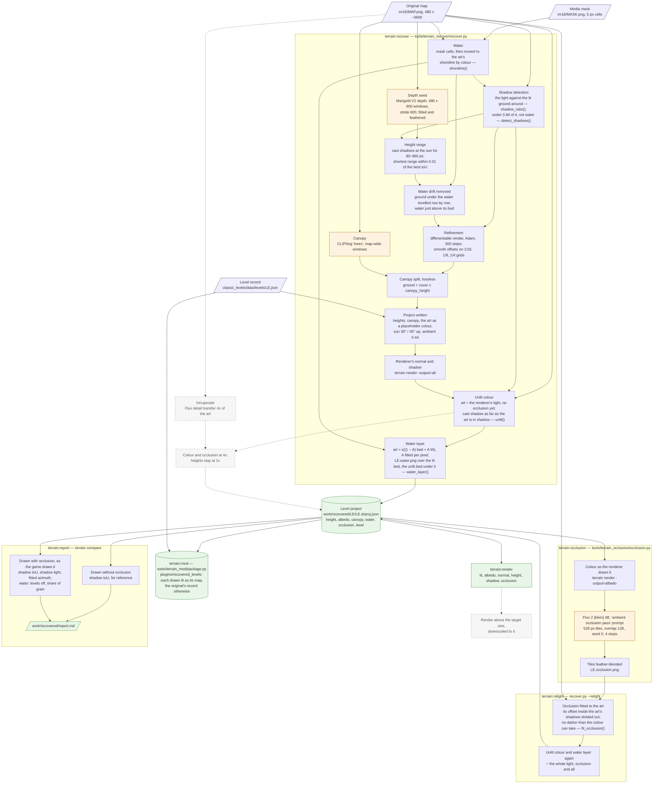

# The level recovery pipeline

How an original map becomes a level project: the heights, the water and
its translucent layer, the unlit colour, canopy and occlusion that the
renderer draws, and the editor
(Stage 7) will open. This is Stage 6 of
[notes/level-editor-plan.md](../../notes/level-editor-plan.md). The
decisions are D55, D56, D57 and D59 in [decisions.md](decisions.md), and the progress
is in [level-editor.md](level-editor.md).

Everything runs headless and through mise, from `src/`:

```sh
mise run terrain:marigold-setup   # once: Marigold V2, pinned (~45 GB)
mise run hd:setup                 # once: the Flux venv (hd:upscale and terrain:occlusion)
mise run terrain:recover-all      # all 12 levels into work/recovered/, then the report
LEVEL=le03 OUT=../work/recovered/le03 mise run terrain:relight   # refit one level's colour to its occlusion, no GPU
LEVELS="le01 le07" mise run terrain:recover-all   # some of them
mise run terrain:mod              # package them as the Recovered Levels plugin
```

Every model is pinned by revision, and every slow step is cached by a hash
of its inputs and settings. A rerun redoes only what changed. Each level's
`manifest.json` and `<stem>.occlusion.json` record the settings, the
software versions and the fit.

## The flow

Solid boxes run today. The dashed ones are the planned HD extension
([below](#planned-hd)).



## Inputs

| Input | Where | Used for |
|---|---|---|
| The map | `plugins/classic_levels/images/im16/<background_image>.png`, 480 x about 3600 | everything |
| The media mask | `…/im16/<media_mask>.png`, one pixel per 5 x 5 map cell; pure blue is water | the water |
| The level record | `plugins/classic_levels/data/levels/leNN.json` | embedded in the project, with its lighting and water filled in |

The original art is never committed (D29). What is derived from it stays
in `work/`.

## The steps

### terrain:recover

`tools/terrain_recover/recover.py`, run in the Marigold venv. Its
docstring has the measurements behind each choice.

| # | Step | How | Model, pinned | Cache |
|---|---|---|---|---|
| 1 | Water | The mask's cells, then, within a cell of their edge, each pixel is water where its Lab colour is nearer the water's around it than the land's (`shoreline()`) | | |
| 2 | Shadow detection | Each pixel's luminance against the 85th percentile in an 81 px neighbourhood, and in a 241 px one taken at quarter size (`shadow_ratio()`); under 0.66 of the first, not water, opened once, is detected (`detect_shadows()`) | | `cache/shadow-ratio-<hash>.npy`, one per size |
| 3 | Depth seed | Overlapping 480 x 900 windows, stride 600. Each window's relative depth is fitted to the previous one on their overlap and feathered in | Marigold V2 depth (Log-stage2), repo `8ea69d69`, weights `cdf9810f`. The fallback is `--seed depth-anything`: Depth Anything V2 Large `7581137e` | `cache/` |
| 4 | Height range | Hard cast shadows at half size, for ranges of 80 to 960 px, scored by IoU against the detected shadows. The shortest range within 0.01 of the best is kept | | |
| 5 | Water drift | The stitched depth drifts along the map. The 90th percentile of the ground under the water, per row, is smoothed over 150 rows and taken out. The water is set 0.5 above its bed, and the land kept above the water | | |
| 6 | Refinement | A differentiable render (a soft horizon along the sun ray, and Lambert shading), fitted by Adam to the detected shadows at half size. Only smooth offsets, on grids of 1/16, 1/8 and 1/4 of the map, with their curvature along the sun penalised (`refine()`) | torch | |
| 7 | Canopy | CLIPSeg asked for "trees", on square windows the map's width, feathered (`canopy_mask()`) | CLIPSeg rd64-refined `999e0328` | `cache/canopy-<hash>.npy` |
| 8 | Canopy split | Under the canopy, the ground is the lower of the ground around filled in and the heights' lower envelope, one crown wide. The cover is the rise above it, over its 99th percentile, so ground + cover x `canopy_height` is the refined heights again (`split_canopy()`) | | |
| 9 | Project | `leNN.drproj.json` with `height.png` (16-bit, 1/32 px units), `canopy.png` and, as a placeholder, the art as the colour. The lighting is sun azimuth 36°, elevation 40°, ambient 0.44, softness 3; the water has its height and median colour | | |
| 10 | The renderer's light | `terrain render -output=all` on that project, headless: its normal and shadow outputs (`render_layers()`) | | `cache/light.*` |
| 11 | Unlit colour | The art divided by ambient + (1 − ambient) x max(n·sun, 0) / sun.z x visibility (`sunlight()`, `unlit()`). The visibility is the renderer's cast shadow counted by how far the art is in shadow: all of it where detected, none where the art is 0.9 of the lit ground or lighter, and in proportion between (`shadow_weight()`). The lit ground here is the lower of the 81 px reference and a 241 px one, because a shadow as wide as 81 px darkens its own reference. Where the light is too little for the art, the colour is scaled to white rather than clipped a channel at a time. This overwrites the placeholder `albedo.png` | | |
| 12 | Water layer | Each water pixel is taken as s x ((1 − A) x bed + A x W). The bed is the land within 4 px of the shore, carried in and blurred (σ 3). W is the lit water more than 12 px from the shore, smoothed over 48 px. A is fitted per pixel over 51 steps, s in closed form, and A smoothed by σ 1 (`water_opacity()`). The colour under the water becomes the unlit bed. The layer's colour is the art less (1 − A) x the bed as the renderer lights it (ambient + (1 − ambient) x its shadow), divided by A, so it keeps the art's grain. `water.png` holds it with A (`water_layer()`) | | `cache/water-opacity-<hash>.npy` |

Step 11 divides by the renderer's own light, so drawing the project at
the original sun puts back the light the art had. Both the slope term and
the shadow come from the renderer, not from a Python copy. On le01 that
took the rendered shadow IoU from 0.709 (shadows divided, slopes not) and
0.887 (the refinement's half-size shadow) to 0.920.

### terrain:occlusion

`tools/terrain_occlusion/occlusion.py`, run in the hd venv.

1. The renderer draws the project's colour (`-output=albedo`). A painted
   level and a recovered one are baked the same way.
2. FLUX.2 [klein] 4B (`e7b7dc27`, Apache-2.0) edits each tile into an
   ambient occlusion pass. The tiles are at most 528 px, overlap by
   128 px, and use seed 0, 4 steps and guidance 1. The tiles are cached at
   `cache/occlusion-<hash>/`.
3. The tiles are feather-blended into `leNN.occlusion.png`, and the project
   names it. White is open ground: flat sand comes out at 255, so no
   rescaling is needed.

The occlusion is inferred from the colour, not computed from the heights,
because the texture shows stones, cracks and the gaps between tree crowns
that the heights don't have. GTAO on the heights and Marigold-normal
relief were tried and lost ([the report](../../work/reports/level-recovery.md),
chapter 6).

The renderer multiplies only the ambient term by it. It is packed into the
albedo texture's alpha, because DrawMesh binds material slots 7–9 as
cubemaps (D56).

The bake is from the colour terrain:recover wrote, which has no occlusion
divided out. terrain:relight then divides it out. Run terrain:occlusion
after terrain:recover, not after a relight: the relit colour misses the
tile cache and bakes again.

### terrain:relight

`recover.py --relight`, in the Marigold venv but with no model: about 45 s
a level on the CPU, 2 min the first time, while the shadow ratios are
computed. It keeps the heights, canopy and water of the project in
`OUT/`, and redoes only its colour, now with the occlusion (D59):

1. **The occlusion is fitted to the art** (`fit_occlusion()`). The
   originals had none: across a shadow's edge the art's light is the
   ambient alone (0.37–0.47 of the lit ground's; the ambient is 0.44). But
   Flux reads the cast shadows still faint in the colour as occlusion, 0.53
   to 0.78 in the art's shadows against 0.82 to 0.90 on the lit ground
   beside. Inside the detected shadows the layer is divided by that offset,
   its local mean inside over its local mean beside, σ 24 px. The crevices
   inside a shadow keep their contrast, and its whole area doesn't.
2. **It is raised to what the art allows** (`occlusion_floor()`). Where the
   ambient under it and the sun could light even a white colour only
   darker than the art, it is raised until they can. Flux's darkest spots,
   50 of 255 on le01's lit banks, would otherwise have needed a colour
   brighter than white.
3. **The colour and the water layer are divided again**, by the whole
   light, the occlusion included, and the water layer fitted over the bed
   so lit.

The fitted layer replaces `leNN.occlusion.png`. The bake as it was is kept
in `cache/occlusion-baked.png`, and `manifest.json`'s `relight` has the
hash of the pixels written. A rerun fits the bake again, unless the layer
has changed since (a new bake, or an edit in the editor), and then it fits
that.

### terrain:report

`terrain compare` draws each project lit, detects the shadows in the render
the same way as in the art, and scores them on the land. It runs twice:

- **with the occlusion**, as the game draws it. This row is the one
  scored against the plan's bar of shadow IoU 0.75. It also gives the
  shadow light (render and art), the water and, with `-fit`, the sun
  azimuth whose cast shadows fit best.
- **with `-no-occlusion`**, for reference. `terrain:relight` fits the
  colour to the occlusion layer (D59), so without it the art's shadows
  draw darker and the IoU is lower (le01: 0.973 → 0.833). Before the
  relight it was the other way round (0.918 against 0.818 with the
  occlusion), because the colour did not expect it.

Both runs also score the water against the art's: the mean colour
difference, in levels of 255, and the render's grain (each pixel less its
3x3 neighbours) as a share of the art's. Across the twelve, with the
occlusion, the water layer is 0.1 to 0.4 levels off with 0.92 to 1.02 of
the grain; flat water, the median colour, was 2.0 to 6.2 levels off with
0.17 to 0.56 (D57).

The table goes to `work/recovered/report.md`, and each level's
side-by-side images to `work/recovered/leNN/`.

## Outputs

Per level, in `work/recovered/leNN/`:

| File | What |
|---|---|
| `leNN.drproj.json` | the project: format, size, layer files, `height_unit`, `canopy_height`, the level record |
| `leNN.height.png` | the ground, 16-bit |
| `leNN.canopy.png` | the canopy's cover, 0–255 of `canopy_height` |
| `leNN.albedo.png` | the unlit colour |
| `leNN.water.png` | the water layer: RGB the water's unlit colour, A how opaque it is |
| `leNN.occlusion.png` | how open to the sky, 0–255, fitted to the art by terrain:relight |
| `manifest.json`, `leNN.occlusion.json` | settings, versions, fits, timings |
| `compare.txt`, `compare-occlusion.txt`, `*.compare*.png` | the scores and side-by-sides |
| `cache/` | depth windows, the shadow ratio, canopy, the renderer's light, occlusion tiles, the occlusion as baked |

`mise run terrain:mod` packages the levels in `work/recovered/` as a
campaign plugin, `plugins/recovered_levels` (Recovered Levels, off by
default). Each project is drawn lit, with its occlusion, as
`images/im16/rlNN.png`. The original's level record is copied with only
`background_image` changed, so the units, previews, masks and music are
the originals'. Turned on in the Mods page, it is a campaign on Level
Select; `deimos -campaign recovered_levels -level Leonidas` plays one
straight away.

`PROJECT=… mise run terrain:render` then draws any of the outputs (lit,
albedo, normal, height, shadow, occlusion) at `SCALE=N`. The renderer
draws the geometry smoothed by a Gaussian with σ 1 map pixel, so the
height steps shade as a smooth surface. The light is
ambient x occlusion x ambient colour + (1 − ambient) x sun colour x
direct x visibility. The water is where the ground itself, unsmoothed, is
under the water line, as the editor's brush decides it. Under the water,
the bed so lit is mixed by A with the water layer lit without the
visibility or the occlusion: the originals' water surface takes no cast
shadow, and only the bed seen through the shallows does (D57). The
occlusion under open water is the ground's, which the surface hides (D59).
The land's normal is its visible surface's, so a bank stops at the water
line and does not fall to the bed beside it.

## Timing

On the Radeon 8060S (Strix Halo), per 480 x 3600 map:

| Step | Time |
|---|---|
| terrain:recover, Marigold depth to unlit colour | about 135 s; about 50 s with the depth cached |
| terrain:occlusion, 9 Flux tiles | about 1 min (6 s a tile) |
| terrain:relight, CPU | about 45 s; 2 min the first time |
| terrain:report, two compares | seconds |

Marigold and Flux run one after the other, never together on one GPU.
Flux peaked at 20.8 GB of VRAM in hd:upscale. On ROCm, the scripts turn
cuDNN (MIOpen) off, because its convolutions fail on gfx1151.

<a id="planned-hd"></a>
## Planned: HD from the start

Not built yet. The idea is to recover at a higher resolution than the art
and to render above the target size, so the final image is better than a
capture at its own size would be.

1. **Upscale the art first.** `hd:upscale` (Flux detail transfer: a
   bicubic 4x for the colour, plus the fine detail of a Flux re-render
   below 1.5 source pixels) is the best 2D upscale found
   ([findings](../../notes/headless-3d-to-2d-findings.md)). A map is
   32 tiles, about 60 s each on the Strix Halo, cached in
   `work/hd/<map>/tiles-<hash>/`.
2. **Keep the heights at 1x.** Marigold's depth from a 2x input scored
   the same shadow IoU (0.55) as from the original, so the seed, range,
   water and refinement stay as they are.
3. **Recover the colour and occlusion at 4x.** The unlit colour would be
   the 4x art divided by the renderer's light drawn at `-scale=4`, with
   the detected shadows upsampled. The occlusion would be baked from the
   4x colour, about 16 times the tiles (about 15 min a map).
4. **Render above the target and downscale.** For a target of k x the map
   size, render at 2k with `-scale` and downscale with a proper filter
   (area or Lanczos). The downscale averages the shadow edges, the
   slopes and the sampled texture, where a capture at k takes one sample
   a pixel.

What it needs:

- **Project layers at their own resolution.** Today every layer is the
  map's size. The colour and occlusion would be k times it, recorded in
  the project. The shader already samples the colour at `map / size`, so
  a larger texture samples correctly without shader changes.
- **A downscale step** in `terrain:render`, such as `SUPERSAMPLE=2`.
- **An HD compare**, scoring the downscaled render against the original at
  1x, so the result can be checked against the no-HD pipeline.

This is also the start of Stage 10's HD layers.

## Future avenues

Ideas that are not planned yet.

- **Water as a live water shader.** The recovered water would be drawn by
  a water shader in the terrain renderer, with the wind at zero, for
  recovery and scoring. The game shares that renderer, so it would run
  the same shader live with wind and animation. The static layer this
  stage bakes becomes the shader's input, so the shader never has to be
  matched to the bake separately.

- **A Flux LoRA for the occlusion.** Train a LoRA for FLUX.2 [klein] on
  Deimos Rising ambient occlusion examples, so the bake learns the game's
  own look rather than relying on the prompt alone.
  - **Where the examples come from.** The originals have no true
    occlusion, so the training pairs would be colour and occlusion taken
    from the current bakes, corrected by hand, or from levels built in
    the editor.
  - **The risk is overfitting.** There are only 12 ground-truth levels,
    covering only a few biomes.
    - Hold out whole levels, or a whole biome, to check that it
      generalises. Judge it on those, against the prompt-only bake.
    - Keep the rank low and the training steps few.
    - Augment with rotations, flips and hue shifts.
    - Check that painted levels in new biomes still bake sensibly, not
      in the look of the 12 originals.
